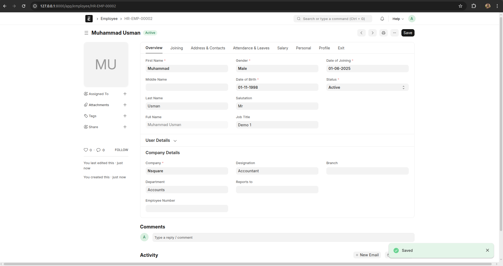

# ERPNext Custom App: Employee Onboarding Workflow

A custom ERPNext application built to streamline the employee onboarding process — assigning tasks, tracking progress, sending notifications, and handling required asset procurement.

---

## Installation

```bash
# Clone the repo into your bench directory
cd frappe-bench/apps
git clone https://github.com/Muhammadshahzad48/onboarding_workflow.git

# Install the app on your site
bench --site your-site-name install-app onboarding_workflow
```

---

## Features Implemented

### 1. Auto Tracker Creation
- When a new Employee is created, the app auto-generates an **Employee Onboarding Tracker** with:
  - Job title
  - Department
  - Joining date
  - Assigned checklist

### 2. Checklist from Template
- Tasks are pulled dynamically based on **job title** from the **Checklist Template** doctype.

### 3. Email Notifications
- Automatic emails are sent to users assigned to tasks in the checklist.

### 4. Required Asset Table
- You can manually enter items (like laptop, mouse, etc.) required for onboarding.

### 5. Material Request Auto-Creation
- If stock is low for any required asset, a **Material Request** is auto-generated to the Purchase department.

### 6. Workflow Integration
- Status of Onboarding Tracker updates from:
  - Draft → Assigned → In Progress → Completed
- A validation ensures status cannot change to `Completed` unless all checklist tasks are marked done.

---

## Custom Doctypes

| Doctype                  | Description                              |
|--------------------------|------------------------------------------|
| Employee Onboarding Tracker | Main tracker linked to Employee         |
| Checklist Template       | Template by job title                    |
| Checklist Template Task  | Child table of tasks for template        |
| Checklist Task           | Child table in tracker with user assignments |
| Required Asset           | Items/assets needed during onboarding    |

---

## Screenshots

### Checklist Template


### Employee Creation



### Employee Onboarding Tracker


### Email Notification Sent


### Material Request Auto-Created


Make sure all images are located inside:
```
/apps/onboarding_workflow/assets/
```

---

## Hook Integration

**Trigger:**  
`after_insert` hook on the `Employee` doctype.

**Function Called:**  
```python
onboarding_workflow.custom.custom_employee.create_onboarding_tracker
```

---

## How to Use

1. Create a **Checklist Template** with tasks for a specific job title.
2. Add assignees to each task in the child table.
3. Create a new **Employee** document.
4. A corresponding **Employee Onboarding Tracker** will be auto-created.
5. You can manually enter any required assets (e.g., Laptop, Mouse).
6. Emails are automatically sent to the task owners.
7. If stock of any required asset is low, a **Material Request** will be submitted.

---

##  Author

**Muhammad Shahzad**  
GitHub: [@Muhammadshahzad48](https://github.com/Muhammadshahzad48)

---

## License

MIT License